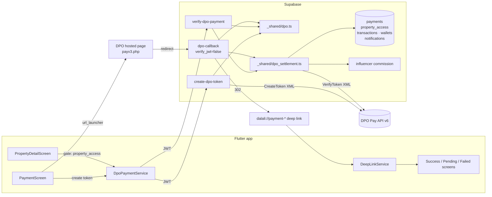
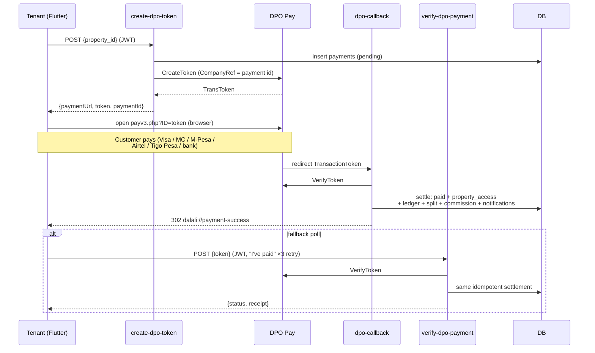
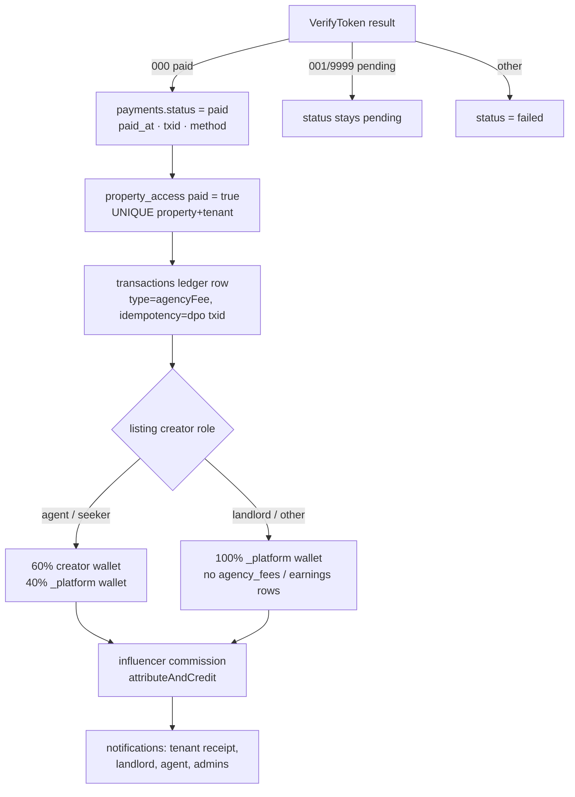

# DPO Pay Integration — DalaliApp

DPO Pay is the **only** payment gateway in DalaliApp. It collects the fixed **20,000 TZS agency fee**; paying unlocks a listing's contact details (phone, SMS, chat) for the tenant.

- API: DPO API v6 (`https://secure.3gdirectpay.com/API/v6/`, XML)
- Hosted payment page: `https://secure.3gdirectpay.com/payv3.php?ID=<token>`
- The DPO **company token is a Supabase secret** — it never appears in client code. The app only talks to Supabase.

## Architecture

## Payment sequence

## Settlement flow (idempotent)

## Components

| Layer | File | Purpose |
|---|---|---|
| Migration | `supabase/migrations/022_dpo_payments.sql` | `payments` + `property_access` (RLS service-role write), drops `payment_gateways` |
| Shared | `supabase/functions/_shared/dpo.ts` | XML builders/parsers, result-code mapping (unit-tested) |
| Shared | `supabase/functions/_shared/dpo_settlement.ts` | `verifyAndSettle` — settle + unlock + ledger + split + commission + notifications |
| Function | `create-dpo-token` | JWT-gated; idempotent token minting (`DPO_COMPANY_TOKEN`, `DPO_SERVICE_TYPE`) |
| Function | `verify-dpo-payment` | JWT-gated app poll; tenant-or-admin ownership check |
| Function | `dpo-callback` | `verify_jwt=false`; browser redirect → `dalali://payment-*` |
| Model | `lib/models/payment_model.dart` | `PaymentModel` + `PaymentStatus` |
| Service | `lib/services/dpo_payment_service.dart` | `createToken` / `verify` / `watchPayment` / `watchPropertyAccess` |
| Screens | `lib/screens/wallet/payment_screen.dart`, `payment_success_screen.dart` (receipt), `payment_failed_screen.dart`, `payment_pending_screen.dart` | Checkout, retry-with-backoff verify, receipt |
| Gate | `lib/screens/shared/property_detail_screen.dart` | call/SMS/chat locked until `property_access.paid` (owners/creators exempt) |
| Deep link | `lib/services/deep_link_service.dart` | `dalali://payment-success|pending|failed?token=` routing |
| Admin | `lib/screens/admin/dpo_payments_admin_screen.dart` | revenue stats + recent payments |

## Environment variables

| Secret | Where | Notes |
|---|---|---|
| `DPO_COMPANY_TOKEN` | Supabase secrets | Test: `B3F59BE7-0756-420E-BB88-1D98E7A6B040` — replace with the live token |
| `DPO_SERVICE_TYPE` | Supabase secrets | Default `85325` (test service); `54841` is the test product |
| `SUPABASE_URL` / `SUPABASE_SERVICE_ROLE_KEY` | injected / secrets | service role stays server-side |
| `ADMIN_API_SECRET` | secrets | gates `process-withdrawal` |

## Security

- Company token only in Supabase secrets; all DPO XML traffic is server-side.
- `payments`/`property_access` have no client write policies (service role only); clients read their own rows.
- `dpo-callback` is unauthenticated by necessity (browser redirect) but performs no privileged reads — it settles idempotently and redirects.
- Settlement is idempotent end-to-end: paid replays short-circuit; ledger `idempotency_key` is the DPO transaction id; commission is `UNIQUE(referred_user_id, conversion_type)`.
- One open payment per tenant per property (partial unique index), so callbacks/polls can't double-charge.

## Production checklist
- [ ] Live `DPO_COMPANY_TOKEN` + live `DPO_SERVICE_TYPE` set as secrets
- [ ] `supabase db push` applied (migration 022)
- [ ] `supabase functions deploy create-dpo-token verify-dpo-payment dpo-callback process-withdrawal`
- [ ] DPO back office: production API access enabled; redirect URL whitelisted if required
- [ ] Test a live small payment end-to-end (token → pay → callback → receipt → contact unlocked)
- [ ] Confirm split: agent/seeker creator 60%, landlord listing 100% platform
- [ ] Admin dashboard shows the payment; notifications delivered

## DPO testing checklist
- [ ] CreateToken returns `000` + token (invalid company token → `801`)
- [ ] payv3 page renders for the token; expired token handled (PTL 60 min)
- [ ] Successful mobile-money payment → VerifyToken `000` → receipt + access
- [ ] Cancelled payment → status `failed`, no access, retry works
- [ ] Double callback + double poll → single settled payment (idempotent)
- [ ] Wrong tenant JWT on verify → `403`

## Go-live checklist
- [ ] Test service `85325` swapped for the live service type
- [ ] Company token rotated from test to live
- [ ] Withdrawals ops runbook updated (manual payouts, `MANUAL-<id>` refs)
- [ ] Customer support briefed: receipts in-app, admin dashboard for lookups

---

## Migration report (Selcom → DPO)

**Files added**: `supabase/migrations/022_dpo_payments.sql`; `supabase/functions/_shared/{dpo.ts, dpo_test.ts, dpo_settlement.ts}`; `supabase/functions/{create-dpo-token, verify-dpo-payment, dpo-callback}/`; `supabase/functions/process-withdrawal/index.test.ts`; `lib/models/payment_model.dart`; `lib/services/dpo_payment_service.dart`; `lib/screens/wallet/{payment_success,payment_failed,payment_pending}_screen.dart`; `lib/screens/admin/dpo_payments_admin_screen.dart`; `DPO_INTEGRATION.md`.

**Files removed**: `lib/services/{selcom_service,payment_service}.dart`; `lib/models/{payment_gateway_model,payment_transaction_model}.dart`; `lib/screens/admin/payment_providers_admin_screen.dart`; `supabase/functions/{selcom-webhook, payment_webhook, update_gateway, check-duplicate-payment, process_withdrawal}/`.

**Files modified**: `lib/screens/wallet/payment_screen.dart` (rewritten for DPO), `lib/screens/shared/property_detail_screen.dart` (contact gate), `lib/services/deep_link_service.dart` + `lib/screens/shared/main_navigation.dart` (payment deep links), `lib/screens/admin/{admin_shell, system_control_panel_admin_screen, commissions_admin_screen, transactions_admin_screen, wallet_screen}` (de-Selcom), `supabase/functions/process-withdrawal/index.ts` (manual ops payout, no Selcom call), `supabase/config.toml` (`dpo-callback` JWT off), `AGENTS.md`, `supabase/DEPLOYMENT_GUIDE.md`.

**Packages**: none removed (Selcom was a plain-HTTP integration; no SDK ever shipped). `url_launcher` and `http` remain — both used by the DPO flow.

**Database**: +`payments`, +`property_access`; −`payment_gateways` (legacy provider-switch config). `transactions`/`wallets`/`withdrawals` kept — the DPO settlement writes the ledger so the 60/40 split and influencer commissions are unchanged. Legacy columns `transactions.selcom_transaction_id` / `withdrawals.selcom_payout_id` are retained for historical rows but no longer written.

**Secrets**: +`DPO_COMPANY_TOKEN`, +`DPO_SERVICE_TYPE`; Selcom gateway config rows deleted with the table.

**Security improvements**: gateway credentials moved from DB config rows to function secrets; single gateway (no provider-switching code paths); contact details are now server-gated behind paid access instead of visible to all.
